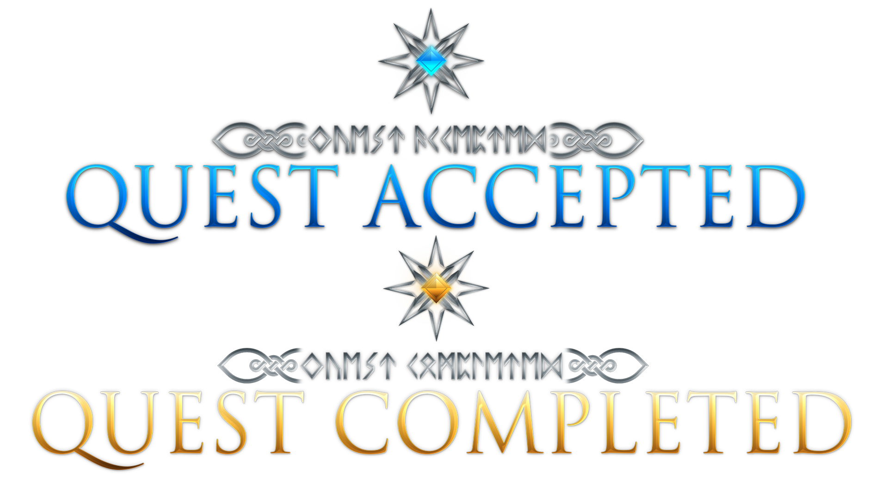
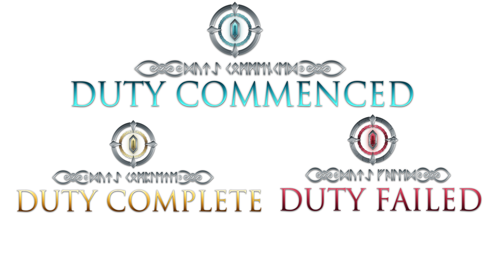
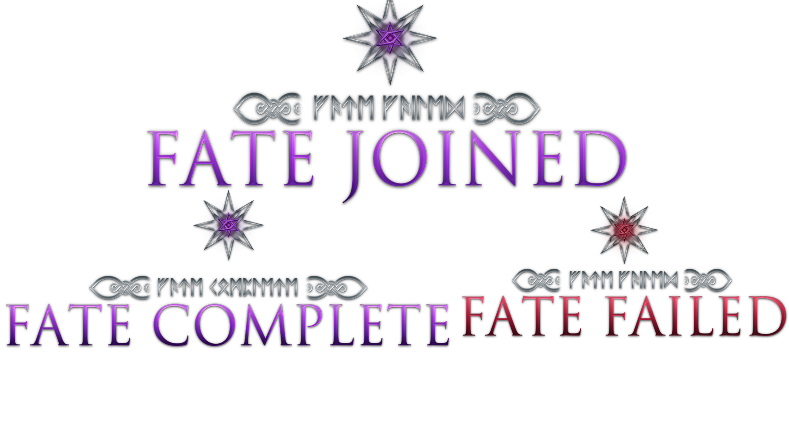
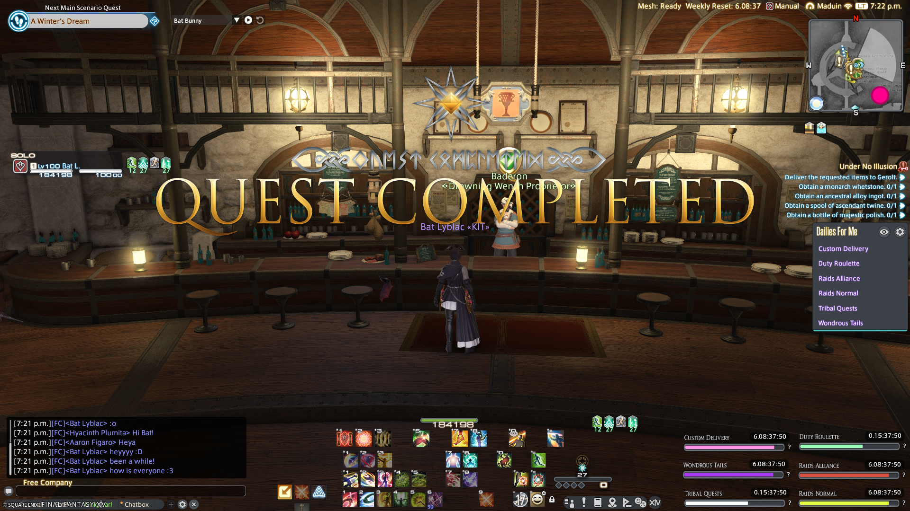

# Title Text Overhaul

Title Text Overhaul is a texture replacement mod pack for FFXIV 7.0+.

It has been created with the intention in mind to improve the ambient screen space in the game instead of making it worse or clouding it up with useless information.

The goal is to replace and redesign the different title textures that appear throughout FFXIV while still keeping them easy to read and fitting with the game.

## Current Version

**Version 2.1.1**

## Download

The latest version of Title Text Overhaul can be downloaded from the [GitHub Releases](../../releases/latest) page.

Current Release: **v2.1.1**

Download the `.pmp` file from the Assets section of the latest release and import it into Penumbra.

## Current Progress

The current workflow has completed up to **Shadowbringers**, though some title text may still be missing.

Reports will show which titles are missing and which ones should or need to be fixed in future updates.

Current expansion progress:

* A Realm Reborn — Complete
* Post-A Realm Reborn — Complete
* Heavensward — Complete
* Post-Heavensward — Complete
* Stormblood — Complete
* Post-Stormblood — Complete
* Shadowbringers — Complete / Review
* Post-Shadowbringers — Not Started
* Endwalker — Not Started
* Post-Endwalker — Not Started
* Dawntrail — Not Started
* Post-Dawntrail — Not Started

## Styles

### Default Style

The main style used throughout Title Text Overhaul.

### Nordic Style

The Nordic Style was created as a requested style and is currently available for:

* Quest Accepted
* Quest Completed
* Duty Commenced
* Duty Failed
* Duty Complete
* FATE Joined
* FATE Failed
* FATE Complete

More titles may be added to the Nordic Style in future updates.

## Previews

### Nordic Style

#### Quest Titles

#### Duty Titles

#### FATE Titles

#### In-Game Preview

*Quest Completed shown in-game using the Nordic Style.*

## Installation

Title Text Overhaul is packaged as a `.pmp` for use with Penumbra.

1. Download the latest `.pmp` from the Releases section.
2. Open Penumbra.
3. Import the downloaded `.pmp`.
4. Enable Title Text Overhaul.

When updating from an older version, it is recommended to remove the previous version before importing the newest `.pmp`.

## Reporting Missing or Incorrect Titles

With the amount of title textures used throughout FFXIV, some may have been missed or may not display correctly.

If you find one, please open an Issue and include:

- The title text that appeared
- Where you encountered it
- Expansion or content type if known
- A screenshot if possible
- Whether the original FFXIV title appeared or something from the overhaul displayed incorrectly

Reports will help identify missing textures and issues that need to be fixed in future updates.

## Updates

Updates will be posted through GitHub Releases.

The changelog will be updated alongside new releases to show newly added textures, updated styles, fixes, and other changes made to the mod.

## Credits

**Amon** — For showing and teaching me the basics of texture replacement and modding.

**dj.USA** — For helping with the most recent Nordic Style implementation and testing, and generally answering all my questions.

**Penumbra Mod Discord & XMA Mod Discord** — All the amazing creators in both communities who continue to help with modding, resources, information, and answering questions.
